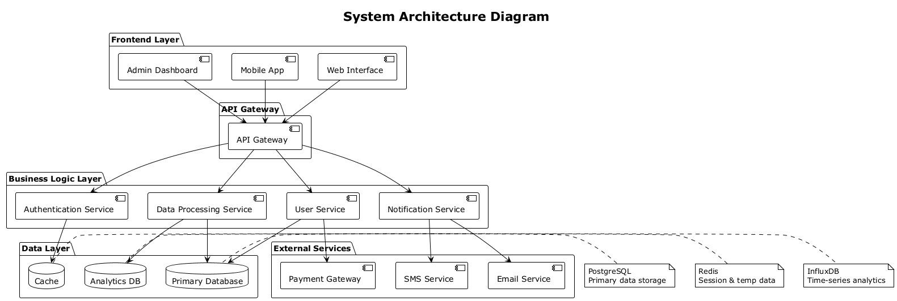

# PlantUML Templates

Template untuk membuat diagram menggunakan PlantUML.

## Files

- `diagram.puml` - Template system architecture diagram
- `system_architecture.png` - Output PNG dengan resolusi tinggi
- `plantuml.jar` - PlantUML JAR file untuk generating diagrams

## Features

- System architecture diagram template
- High-DPI output (300 DPI) untuk kualitas print
- Siap embed ke LaTeX, Quarto, atau Markdown
- Professional styling dengan packages dan connections

## Usage

```bash
# Generate PNG dari .puml file
java -jar plantuml.jar -tpng -Sresolution=300 diagram.puml

# Generate dengan resolusi standar
java -jar plantuml.jar -tpng diagram.puml

# Generate multiple formats
java -jar plantuml.jar -tpng -tsvg diagram.puml
```

## Embedding

**LaTeX:**
```latex
\includegraphics[width=0.8\textwidth]{system_architecture.png}
```

**Quarto/Markdown:**
```markdown
{width=60%}
```

## Diagram Types

Template bisa dimodifikasi untuk berbagai jenis diagram:
- System architecture
- Database schemas
- Flowcharts
- Sequence diagrams
- Class diagrams